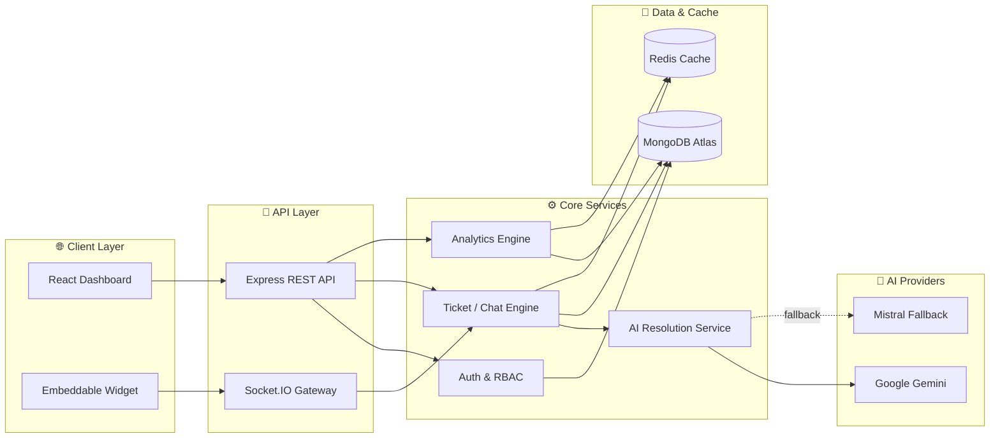

<div align="center">

# ⚡ ResolveAI

### The AI Support Layer for Modern SaaS Teams

**Turn every customer conversation into an instant, intelligent resolution — powered by AI, backed by humans.**

<br/>

[](https://reactjs.org/)
[](https://nodejs.org/)
[](https://www.mongodb.com/)
[](https://redis.io/)
[](https://socket.io/)
[](https://ai.google.dev/)

<br/>

[Overview](#-overview) • [Features](#-key-features) • [Architecture](#-system-architecture) • [Tech Stack](#-tech-stack) • [Getting Started](#-getting-started) • [API Reference](#-api-reference) • [Scaling](#-scaling-for-millions-of-users)

</div>

<br/>

---

## 🎯 Overview

**ResolveAI** is a full-stack, AI-native customer support platform built for SaaS companies that refuse to make their customers wait. It fuses a real-time agent dashboard, an embeddable chat widget, autonomous AI ticket resolution, and operational analytics into one seamless workflow — so support teams spend less time triaging and more time solving.

Under the hood, ResolveAI answers with AI first, escalates to a human the moment confidence drops, and remembers the full context of every conversation along the way.

> **In short:** customers get instant answers. Agents get the tickets that actually need them. Founders get the dashboard that proves it's working.

<table>
<tr>
<td width="25%" align="center"><b>🤖 AI-First</b><br/><sub>Grounded responses from your own knowledge base</sub></td>
<td width="25%" align="center"><b>🔄 Seamless Handoff</b><br/><sub>Escalates to humans exactly when needed</sub></td>
<td width="25%" align="center"><b>📊 Full Visibility</b><br/><sub>Real-time analytics on every metric that matters</sub></td>
<td width="25%" align="center"><b>🏢 Multi-Tenant</b><br/><sub>Built for teams and organizations from day one</sub></td>
</tr>
</table>

---

## ✨ Key Features

### 💬 Customer Experience
- Real-time embeddable chat widget for websites and customer portals
- AI-first response handling grounded in your knowledge base — not generic hallucinations
- Automatic escalation to a human agent the moment AI confidence drops
- Persistent conversation memory for genuinely contextual support
- Dual intake: live chat *and* contact-form ticket creation

### 🛠️ Operations & Team Management
- Admin and agent dashboards purpose-built for fast ticket resolution
- Role-based team invitations and access control
- Conversation ownership with live takeover workflows
- Internal notes for behind-the-scenes agent collaboration
- Automated email notifications for escalations and ticket updates

### 📈 Intelligence & Analytics
- AI training pipeline that ingests knowledge from URLs or manual entries
- Live dashboards for tickets, resolution rate, response time, and status trends
- Sentiment, category, and agent-performance breakdowns
- Redis-backed caching for sub-second dashboard loads at scale

---

## 🏗️ System Architecture



**Design principles:** stateless API instances behind a load balancer, AI calls isolated behind a dedicated service layer with automatic provider fallback, and Redis sitting in front of Mongo for every read-heavy dashboard query.

---

## 🧰 Tech Stack

| Layer                     | Technologies                                                                    |
| ------------------------- | -------------------------------------------------------------------------------- |
| **Frontend**               | React 19, Vite, React Router, Socket.IO Client, Framer Motion, GSAP, Recharts     |
| **Backend**                 | Node.js, Express.js, Socket.IO, JWT, Helmet, CORS, Express Rate Limit             |
| **Database**                | MongoDB with Mongoose                                                             |
| **Cache & Session Layer**   | Redis via ioredis                                                                 |
| **AI Services**             | Google Gemini (primary) with Mistral fallback                                    |
| **Email & Notifications**   | Nodemailer                                                                        |
| **Deployment**              | Vercel (frontend) · Render / Railway / DigitalOcean (backend) · Atlas + Redis Cloud |

---

## 📁 Project Structure

```text
resolve_ai/
├── backend/
│   ├── config/               # DB, Redis, and environment configuration
│   ├── controllers/          # Auth, chat, widget, analytics, AI, ticket logic
│   ├── middleware/           # Auth, validation, rate limiting
│   ├── models/                # Mongoose schemas for users, tickets, conversations, messages
│   ├── routes/                # REST API route definitions
│   ├── services/              # AI, crawler, email, assignment services
│   ├── sockets/                # Socket.IO event handling
│   └── server.js               # Application entry point
├── frontend/
│   ├── public/                 # Static assets and widget bundle
│   ├── src/
│   │   ├── context/            # Auth and Socket state providers
│   │   ├── layouts/            # Layout containers and dashboard shell
│   │   ├── pages/               # Landing, login, dashboard, tickets, analytics, settings
│   │   ├── services/             # API integration layer
│   │   └── App.jsx                 # Route configuration
│   └── package.json
├── architecture.md            # System design and architecture notes
├── Plan.md                     # Product implementation plan
└── README.md                    # Project documentation
```

---

## 🚀 Getting Started

### Prerequisites

- Node.js 18+
- MongoDB instance or MongoDB Atlas
- Redis instance or managed Redis service
- API credentials for Gemini or Mistral

### Installation

```bash
git clone <repository-url>
cd resolve_ai

cd backend
npm install

cd ../frontend
npm install
```

### Run Locally

**Terminal 1 — Backend**
```bash
cd backend
npm run dev
```

**Terminal 2 — Frontend**
```bash
cd frontend
npm run dev
```

| Service      | URL                          |
| ------------ | ----------------------------- |
| Frontend      | http://localhost:5173         |
| Backend API    | http://localhost:5000         |

---

## 📚 API Reference

**Base URL:** `http://localhost:5000/api`

<details>
<summary><b>🔐 Authentication</b></summary>

| Method | Endpoint         | Description                          |
| ------ | ----------------- | -------------------------------------- |
| POST   | `/auth/register`   | Register a new organization owner       |
| POST   | `/auth/login`       | Authenticate user and return JWT        |
| GET    | `/auth/me`           | Fetch authenticated user profile        |
| POST   | `/auth/refresh`       | Refresh access token                    |
| POST   | `/auth/invite`         | Invite team member to organization      |

</details>

<details>
<summary><b>🏢 Organization</b></summary>

| Method | Endpoint                            | Description                          |
| ------ | ------------------------------------- | -------------------------------------- |
| GET    | `/organization`                        | Fetch current organization details      |
| PUT    | `/organization`                          | Update organization settings            |
| GET    | `/organization/members`                    | List organization members               |
| PUT    | `/organization/members/:memberId`           | Update team member role                 |
| DELETE | `/organization/members/:memberId`             | Remove team member                      |
| GET    | `/organization/widget/:slug`                    | Fetch widget configuration              |
| GET    | `/organization/email/status`                      | Check email configuration status        |
| POST   | `/organization/email/test`                          | Send a test email                       |

</details>

<details>
<summary><b>🎫 Tickets & Conversations</b></summary>

| Method | Endpoint                    | Description                                    |
| ------ | ----------------------------- | ------------------------------------------------ |
| GET    | `/tickets`                      | List tickets for the authenticated organization   |
| GET    | `/tickets/stats`                  | Fetch ticket statistics                           |
| GET    | `/tickets/:id`                      | Get a single ticket                               |
| POST   | `/tickets`                            | Create a new ticket                               |
| PUT    | `/tickets/:id`                          | Update ticket status, priority, or owner          |
| POST   | `/tickets/:id/notes`                      | Add an internal note                              |
| GET    | `/tickets/:id/ai-summary`                   | Generate an AI-powered summary                    |
| GET    | `/chat`                                       | List conversations                                |
| GET    | `/chat/:id/messages`                            | Fetch conversation history                        |
| POST   | `/chat/:id/messages`                              | Send a new message                                |
| POST   | `/chat/:id/takeover`                                | Take over a conversation                          |
| POST   | `/chat/:id/resolve`                                   | Resolve a conversation                            |

</details>

<details>
<summary><b>📊 Analytics & AI Training</b></summary>

| Method | Endpoint                | Description                                    |
| ------ | -------------------------- | ------------------------------------------------ |
| GET    | `/analytics/dashboard`       | Fetch dashboard analytics                         |
| GET    | `/analytics/detailed`          | Fetch detailed and segmented analytics            |
| GET    | `/training`                       | List training data                                |
| POST   | `/training`                          | Add training content manually                     |
| PUT    | `/training/:id`                        | Update training entry                             |
| DELETE | `/training/:id`                          | Delete training entry                             |
| POST   | `/training/crawl`                          | Crawl a website for knowledge-base ingestion      |
| POST   | `/training/test`                             | Test AI responses using current context           |

</details>

<details>
<summary><b>🧩 Widget & Health</b></summary>

| Method | Endpoint            | Description                        |
| ------ | ---------------------- | ------------------------------------ |
| POST   | `/widget/start`           | Start a widget-based conversation     |
| POST   | `/widget/message`           | Send a message through the widget     |
| POST   | `/widget/contact`             | Submit a contact form message         |
| GET    | `/health`                        | Health check endpoint                 |

</details>

---

## ☁️ Deployment

### Recommended Production Setup

| Component      | Recommendation                                |
| -------------- | ------------------------------------------------ |
| Frontend         | Vercel or Netlify                                  |
| Backend           | Render, Railway, Fly.io, or AWS ECS                  |
| Database           | MongoDB Atlas (managed NoSQL)                          |
| Cache               | Redis Cloud or Upstash                                    |
| Assets                | CDN-delivered static assets                                 |

### ✅ Production Checklist

- [ ] Configure environment variables securely
- [ ] Enable HTTPS and domain-based CORS rules
- [ ] Set up structured logging and alerting
- [ ] Apply rate limiting and API protection middleware
- [ ] Configure backups, monitoring, and autoscaling policies

---

## 📈 Scaling for Millions of Users

ResolveAI's architecture is designed to evolve from a single-service deployment into a horizontally scalable platform without a rewrite.

**Scale strategy**
- Backend behind a load balancer, running as multiple stateless instances
- Redis Cluster for distributed caching and cross-instance session coordination
- AI inference and long-running jobs offloaded to background workers/queues
- Kafka or RabbitMQ to decouple real-time events from async AI workloads
- MongoDB sharding + index optimization for high write throughput
- Dedicated read replicas / aggregation pipelines for analytics workloads
- Clustered WebSocket gateways for real-time chat at scale
- Full observability via OpenTelemetry, Prometheus, and Grafana

**Architectural evolution**
- API gateway for centralized auth, routing, throttling, and tracing
- Containerization with Docker, orchestrated via Kubernetes or ECS
- Edge caching and CDN support for static frontend delivery
- Fully asynchronous AI processing for ingestion and summarization
- Connection pooling and request batching for high concurrency
- Tenant-aware partitioning to isolate multi-organization workloads

---

## 🤝 Contributing

Contributions are welcome and genuinely appreciated.

1. Fork the repository
2. Create a feature branch (`git checkout -b feature/your-feature`)
3. Commit your changes with clear, descriptive messages
4. Open a pull request with a detailed summary of what changed and why

---

<div align="center">

**Built with precision, scalability, and AI-first product thinking.**

⭐ If ResolveAI's architecture is useful to you, consider starring the repo.

</div>