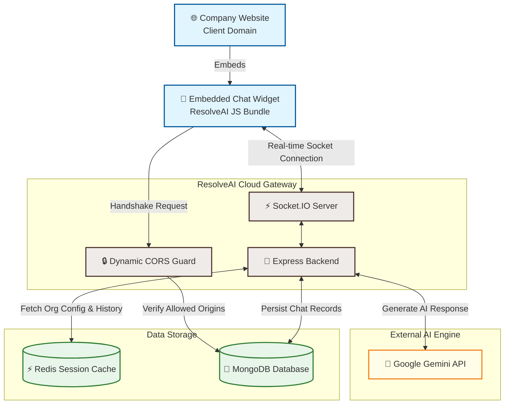
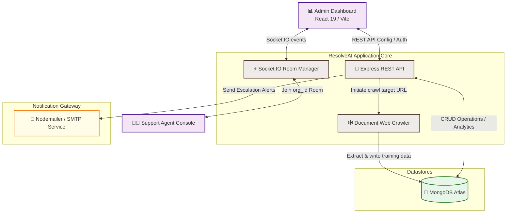
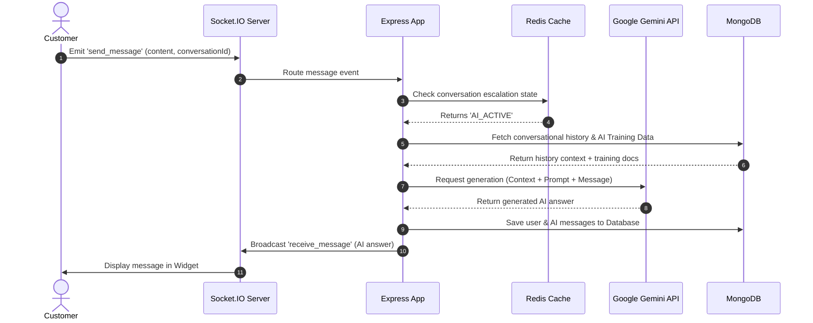
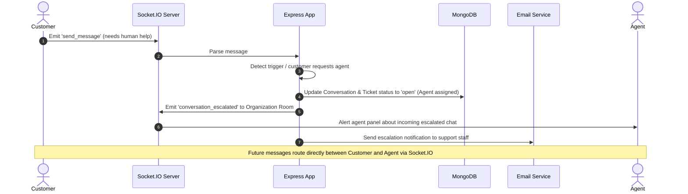

# 🤖 ResolveAI: High-Level System Architecture & Design

This document details the high-level system architecture, design decisions, database layout, and interaction patterns of **ResolveAI**—a next-generation, full-stack customer support platform that integrates real-time communications with generative AI automation.

---

## 🏛️ High-Level Design (HLD) Perspectives

To fully understand ResolveAI, we look at the system from two distinct operational viewpoints: the **User (Customer) Perspective** and the **Company (SaaS Tenant) Perspective**.

---

### 1️⃣ User (Customer) Perspective HLD
This perspective describes how a customer visiting an external website interacts with the embedded chat widget.

#### Key Flows for the Customer:
1.  **Widget Loading:** The widget is embedded on the company's website. The browser sends a connection request to ResolveAI.
2.  **CORS Verification:** The backend dynamically checks the HTTP `Origin` header against database records of registered organizations.
3.  **Chat Session:** The customer sends messages over WebSockets. They receive instant responses either from the **Gemini AI** (using training context) or from a **Live Agent** (if escalated).

---

### 2️⃣ Company (SaaS Tenant) Perspective HLD
This perspective shows how a registered customer support organization signs up, trains the AI, logs into the dashboard, and handles escalated tickets.

#### Key Flows for the Company:
1.  **Onboarding & Configuration:** The company registers, enters their website domain, and configures brand settings.
2.  **AI Training & Ingestion:** The company inputs their documentation URLs. The backend runs the `crawlerService.js` to scrape text, saving it directly to MongoDB as training data.
3.  **Real-Time Handoff:** Agents log into the Console and join their organization's socket room. When a customer's conversation is escalated, the socket server notifies all active agents, and Nodemailer sends email alerts.
4.  **Analytics:** The dashboard aggregates conversation metrics and charts using the analytics API, reporting ticket trends.

---

## 📦 Subsystems & Architecture Components

### 1. Frontend Clients
*   **Support & Admin Dashboard (`/frontend`):** Built with React 19 and Vite. It serves as the portal for support agents to manage organizations, train AI models (by crawling websites), configure settings, view analytics charts (Recharts), and chat in real-time with customers.
*   **Embeddable Chat Widget:** A lightweight chat client injected into third-party customer websites. It handles connection establishment, session tracking, and real-time messaging.

### 2. Express.js Backend Server (`/backend`)
*   **Entry Point (`server.js`):** Bootstraps the Node.js process, establishes connections to MongoDB and Redis, configures Express middlewares (Helmet, CORS, Rate Limiters), routes endpoints, and initializes Socket.IO.
*   **Dynamic CORS Middleware:** Evaluates incoming origin domains against database organizations to allow dynamic chat widget rendering on external client websites while blocking unauthorized domains.

### 3. Real-Time Socket Layer (`backend/sockets`)
*   **SocketHandler (`socketHandler.js`):** Manages event-driven communication. Uses room partitioning to isolate conversations.
    *   *Rooms:* Customers join rooms keyed by conversation ID. Agents join rooms keyed by organization ID to monitor active tickets.
    *   *Status Shifts:* Manages transitions when the chat status shifts from `AI` (handled by Gemini) to `Agent` (escalated to humans).

### 4. AI & Integration Services (`backend/services`)
*   **AI Service (`aiService.js`):** Encapsulates the Google Generative AI (Gemini) SDK. Implements:
    *   *System Prompts:* Restricts Gemini to answering based *only* on ingested organization training data.
    *   *Context Management:* Resolves coreferences (e.g., matching "it" or "they" to products mentioned previously) and passes short-term memory back to the model.
*   **Web Crawler Service (`crawlerService.js`):** Crawls specified target domains (using Axios and Cheerio) to extract raw text content, sanitizing HTML tags and extracting structured documentation for AI training data.
*   **Email Service (`emailService.js`):** Integrates SMTP settings configured per organization to notify support staff of escalations.

### 5. Storage & Caching Layer
*   **MongoDB Atlas:** Stores schema-validated entities such as Organizations, Users, Tickets, Conversations, Messages, and AI training datasets.
*   **Redis (ioredis):** Leveraged for caching frequently accessed settings and tracking inactive chat sessions. Uses Redis TTL (Time-To-Live) keys to trigger automatic session-expiry operations.

---

## 🔄 Core Data & Message Flows

### 1. The Real-Time Chat Loop (AI Mode)

### 2. Conversation Escalation Flow (Handoff to Human Agent)

---

## ⚡ Design Patterns & Architecture Best Practices

*   **Repository / Controller Pattern:** Decouples Express routes, route controllers, database schemas, and business services. Routes only manage paths; Controllers extract params and return responses; Services execute business logic.
*   **Dynamic Room Partitioning:** Isolates real-time messages by assigning customers to room `conversation_<id>` and agents to `org_<id>`.
*   **Inactivity Expiry (TTL Caching):** Uses Redis Key-space notifications or polling timers to track user inactivity. If a customer is idle for >2 hours, the session expires, automatically purging the ephemeral chat token to preserve privacy.
*   **Fail-Soft Database Resiliency:** If Redis is down, the backend falls back gracefully to MongoDB query fallbacks, preventing a crash.
